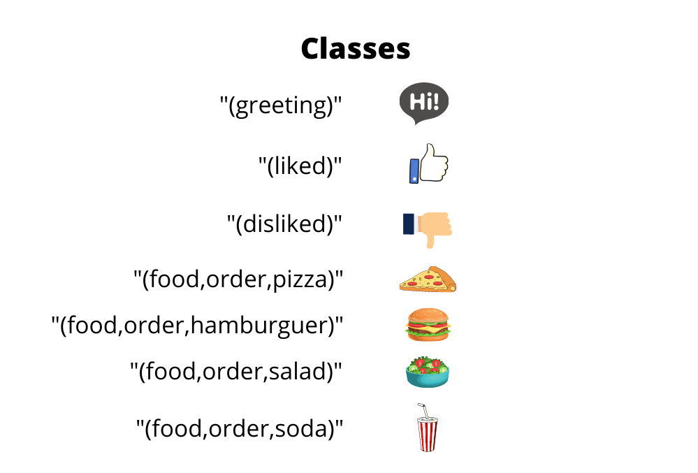
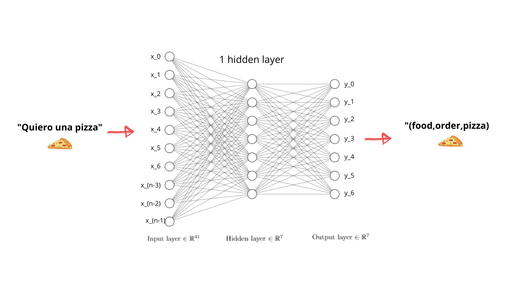
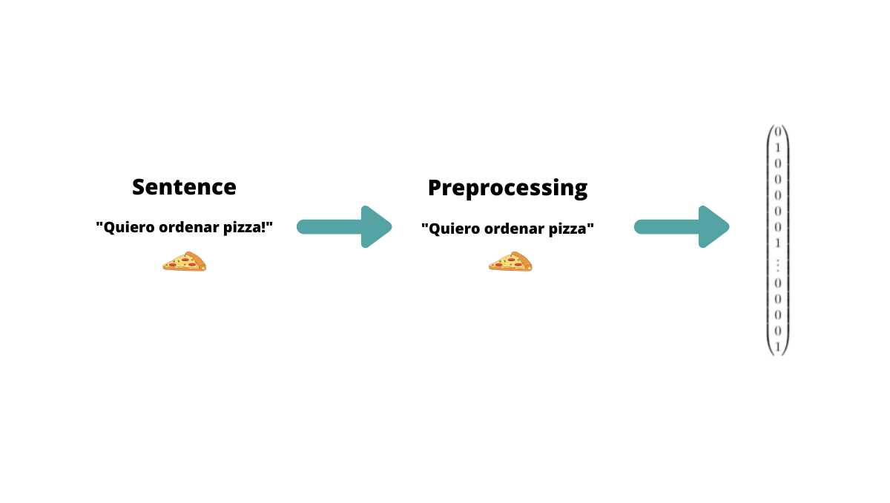
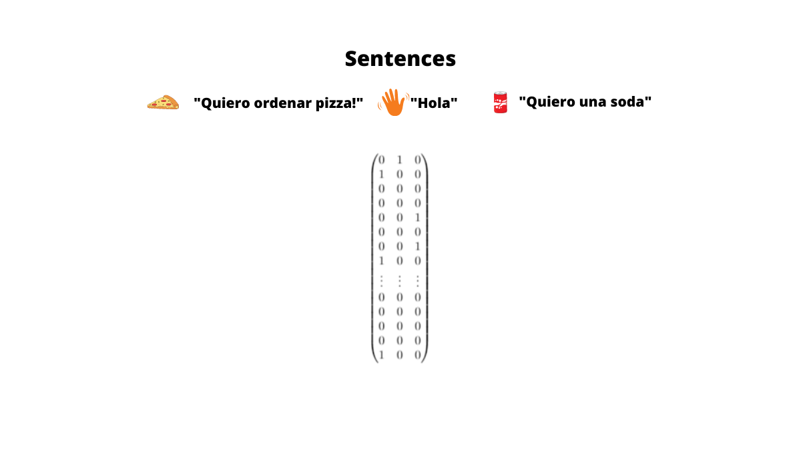
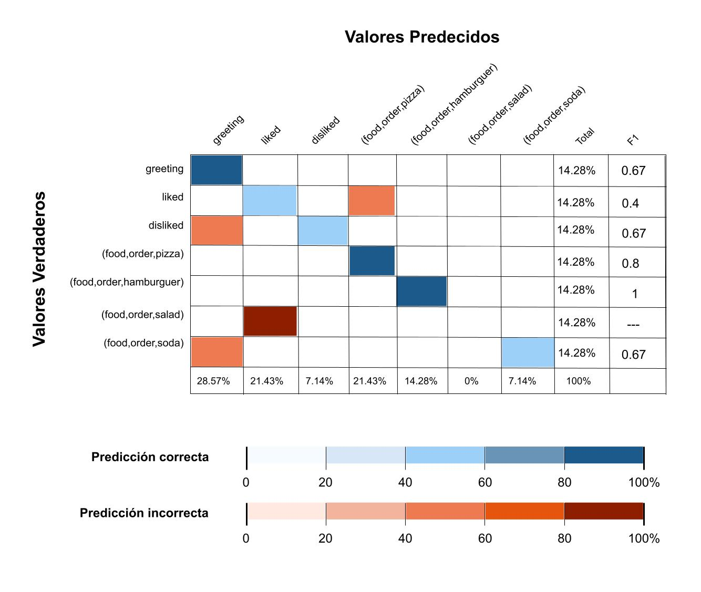

# Text Classification project

In this project we are going to classify text using a neural network. Our approach is to use a supervised learning strategy. The development of this project was done with pure Golang and the Gonum package. Go Chi is used to serve the API.

## Begining 🚀

These instructions allow you to obtain a copy of the project, which you can run on your local machine.

### Pre-requirements 📋

```
go1.16.5  ->  https://golang.org/dl/
go-chi    ->  https://pkg.go.dev/github.com/go-chi/chi
gonum     ->  https://pkg.go.dev/gonum.org/v1/gonum
```

## Content 📘

1. [Motivation](#motivation)
2. [Neural Network](#network)
   - [Architecture](#architecture)
   - [Preprocessing](#preprocessing)
   - [Training](#training)
   - [Results](#results)
3. [Routing](#routing)
4. [deployment](#deployment)
5. [Further work](#further-work)

## Motivation

Our task is to develop a bot with which people can communicate, the logic of the business is oriented to a service of taking requests from the clients of  **Los Gophers Hermanos restaurant** (This is a Pun of Gopher the mascot of Go and Los Pollos Hermanos from Breaking Bad 😅 _Say my name_).

You can access the repository of the web application where we use this repo by clicking [here](https://github.com/fabricioism/gopher-hermanos-chat).

And our live demo [here](https://los-gophers-hermanos-chat.vercel.app/)

## Network

In our neural network we want to classify greetings, likes, dislikes and the orders of our clients. That is why we will take a multiclass classification strategy, where given an entry it will be classified and it will be proposed to which class the sentence corresponds.

In the following image we have the classes that our neural network can classify.



### Architecture

We are going to have 3 layers, one of them is the input layer, we will have a hidden layer and an output layer.

The following image shows our architecture.



### Preprocessing

Since we are working with text, it is necessary to try to correct some of the sentences before handing them over to the neural network. Our strategy will be:

1. Make all the letters of the sentences lowercase
2. Replace the accents with the corresponding vowels
3. Replace some special characters.

### Training

Our neural network was trained with the following parameters.

1. Neurons of the input layer: 41
2. Neurons of the hidden layer: 7
3. Output layer neurons: 7
4. Number of iterations: 5000
5. Learning rate: 0.05

What we did was tokenize each statement of the training data and insert them into a "Bag of words". This bag of words helps us to establish the model on which we are going to use each training instance and operate with them within the neural network.

If you want to know more about "Bag of words" click [here](https://en.wikipedia.org/wiki/Bag-of-words_model).

The following image exemplifies the treatment that will be done to the sentences. They are cleaned and then according to the "Bag of words" we will model that sentence in a matrix, where each element is the number of occurrences of each word.



Then, in a matrix we are going to locate each training instance.



#### Activation functions

For our hidden layer we are going to use the ReLU function as a function. And for the output layer we will make use of the Sigmoid activation function.


### Results
Here we have the confusion matrix



## Routing

The endpoint through which it can be accessed to make a prediction is by the following.

```
Method: POST
Endpoint: /v1/predictions
```

**Note.** You can make a request to the following URL.

```
https://gopher.fabricioism.com/v1/predictions
```

You must send the following body of the request payload:

```
{
    "sentence": "your sentence"
}
```

And it is responded with the following JSON.

```
Status: 200

{
  "prediction": "(food,order,pizza)"
}
```

## Deployment

I have put the image in docker so that you can quickly run your service and connect from your web application. I leave you here the docker commands. 🐳

```
docker push fabricioism/go-nn-text-classification:tagname
```

Follow this [link](https://hub.docker.com/repository/docker/fabricioism/go-nn-text-classification)

## Further work

I think the performance could improve a lot if we do a deeper work on the processing, specifically on using the roots of the words. For example, the words "having" and "have" could be reduced to their stem "hav". This is one of the approaches that NLP does.

If you want to know more about Stemming click [here](https://nlp.stanford.edu/IR-book/html/htmledition/stemming-and-lemmatization-1.html)

In particular I am interested in applying Porter's algorithm. Make its equivalent for sentences in Spanish.

You can read more about Porter's Algorithm [here](http://facweb.cs.depaul.edu/mobasher/classes/csc575/papers/porter-algorithm.html)

I hope this whole project will help you. If you have feedback for improvement let me know, it's good to know the opinion of others.

Take care and do not drink while driving.
